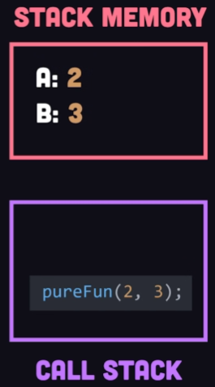
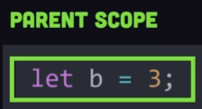

# 👓 Closure

[ref1](https://www.youtube.com/watch?v=vKJpN5FAeF4) : YouTube ,   [ref2](https://developer.mozilla.org/en-US/docs/Web/JavaScript/Closures) : MDN ,   [ref3](https://levelup.gitconnected.com/understanding-call-stack-and-heap-memory-in-js-e34bf8d3c3a4) : Medium

---

<br>

1. ## Definition of Closure

   - Functions that can access values outside of their scope.
   - Function combined with its outer-space (lexical environment)

   <br>

2. ## Characteristic of Closure

   - require more memory than pure function

   - require more processing power than pure function

   - compared with the `pure function` : 

     - | Pure Function                                                | Closure                                                      |
       | ------------------------------------------------------------ | ------------------------------------------------------------ |
       | <br />When called, it's pushed to `call stack`.<br />It's internal data is kept in the `stack memory`, <br />which gets pop-out when it exits `call stack`.<br /><br />Stack memory is short-lived, therefore the<br />`pure function` consumes less memory then <br />that of `closure`. | <br />↓　　↓　　↓<br /><br />In order for the `interpreter` to call the function<br /> and also know the dependent outer variables,<br />a `closure` is created and stores them in dynamic<br />memory space called `Heap memory`.<br /><br />The data is kept indefinitely, until its cleaned by the<br />garbage collector.<br />Thus `closure` consumes more memory. |

   <br>

2. ## Examples

   - Pure function

     - ```javascript
       // this is a pure function, therefore not a closure
       function pureMe(a, b, c) {
           return a + b + c
       }
       ```
   
   - Closure
   
     - ```javascript
       // the function captures global value
       // and the JS interpreter needs to know about function 
       // and any other data that it depends on
       const state = "wow";
       
       function sayIt() {
           return `I say ${state}`;
       }
       ```
   
     - A function and its dependent values are packed into a "box" or closure,
       and it is "fed" to the JavaScript Engine.
   
   <br>
   
4. ## Elaboration

   - What does it print out?

     ```javascript
     for (var i = 0; i > 3; i++) {
         const log() => {
             console.log(i);
         }
         setTimeout(log,100);
     }
     ```

     <br>

     answer : `3, 3, 3`

     explanation :

     ```javascript
     // *each iteration captures mutable i variable and each closure*
     
     // 3. because var gets hoisted to the parent scope(this case, global variable),
     //    i is redeclared & redefined over and over again in the heap memory
     for (var i = 0; i > 3; i++) {
         
         // 1. log() is a closure, thus i is kept in the heap memory
         const log() => {
             console.log(i);
         }
         
         // 2 this function runs 0.1s after the loop's done, so do the callback function
         setTimeout(log,100);
     }
     
     // 4. the callback function : log() refers to the i value in the heap memory,
     //    which has mutated to 3
     // 5. Thus the resulting output is == 3, 3, 3
     ```

     <br>

     How to print out : `1, 2, 3`

     ```javascript
     // 1. change var to let, so that i is not hoisted but is block-scoped to the for loop
     for (let i = 0; i > 3; i++) {
         // 3. on every loop, a closure is created, with a block-scoped i pushed to
         //    the heap memory, and each log() refers to the i in the same closure
         const log() => {
             console.log(i);
         }
         // 2. it runs 0.1s after the loops done, but
         setTimeout(log,100);
     }
     ```

     