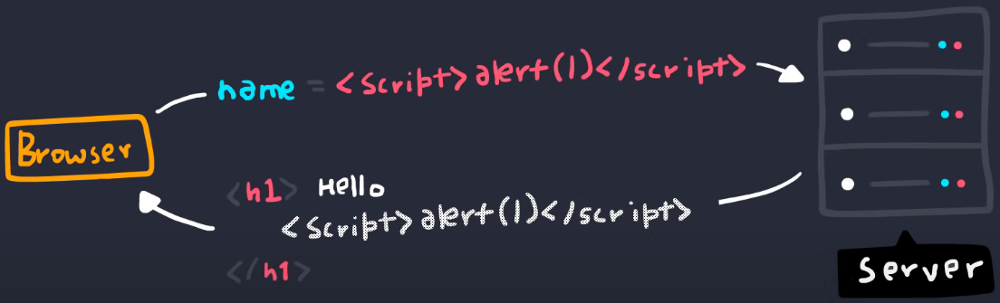
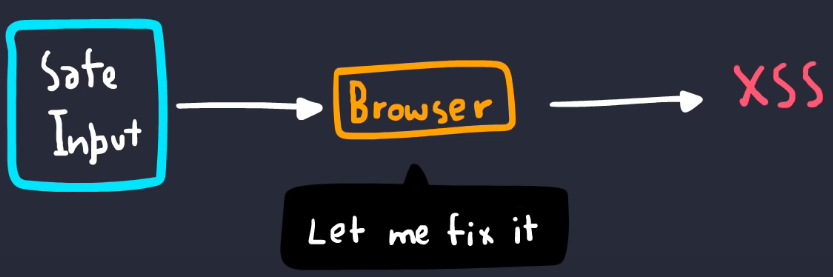

# 🏌 CSRF & XSS

[ref 1](https://www.youtube.com/watch?v=mPqY5AD79NI) ,   [ref 2](https://dev.to/maleta/cors-xss-and-csrf-with-examples-in-10-minutes-35k3) ,   [ref 3](https://www.youtube.com/watch?v=atNmPzdvPD4) ,   [ref 4](https://www.youtube.com/watch?v=EoaDgUgS6QA) ,   [ref 5](https://www.youtube.com/watch?v=_3Wgx1FabIo)

---


## CSRF (cross-site-request-forgery)

1. ### 요약

   - 사이트 간 요청 위조
   - 주로 특정 링크를 클릭하게 하여, 강제로 사이트의 특정 기능을 실행시킴.
   - **서버로 접근하여 서버상의 상태정보를 바꿈**. 주로 패스워드 변경.

2. ### 공격 방법

   1. `fishing` 링크를 보내어 사용자에게 클릭을 유도
   2. 사용자가 링크 클릭
   3. 이미 로그인 되어있는 사이트에서, 강제로 패스워드 변경 요청을 서버로 보내버림
   4. 링크 클릭 만으로, 해당 사이트의 아이디는 이제 해커가 소유.

3. ### 예방

   - 토큰 인증 방식을 활용하여, 토큰을 로컬 or 세션 스토리지에 저장함으로써 타 도메인으로부터의 접근을 차단.
   - `csrf  token`을 활용하여 서버로 요청을 보낼 때 마다 유효한 사용자임을 확인함으로써, 해커가 서버로 해당 토큰 없이 요청 불가능.

<br>

## XSS (cross-site-scripting)

1. ### 요약

   - 브라우저(클라이언트)로 접근

   - 브라우저 상에서 악성 `JS`코드 실행

   - 이론상 **웹 서비스 자체의 기능과 데이터를 조작 가능**

2. ### 종류

   1. `Reflected XSS (일시적 xss)` : 인풋된 `JS`코드가 서버로부터의 응답에 반영됨.
      

   2. `Stored XSS (지속적 xss)` : 인풋된 `JS`코드가 `DB` 등에 영향을 줌.

      ```html
      <!-- 해당 JS코드가 웹 사이트에 코멘트로 적힌다면 웹 서비스의 DB에 저장이 될것이고, -->
      <script>alert("this is me!")</script>
      
      <!-- 해당 코멘트를 본 다른 사용자들은 모두 alert 메세지를 받게된다 -->
      ```
      
   3. `DOM XSS` : DOM을 활용하여 사용자의 인풋값으로 클라이언트의`JS`코드에 영향을 줌.

      ```html
      <!-- img 태그의 특성을 이용하여 alert 화면을 발생시키는 예시 (이미지 로드가 안되면 JS코드 실행) -->
      
      <!-- https://test.com/frame#3 -->
        <!--기본-->
      
      <!-- https://test.com/frame#3xss' onerror='alert('xss gogo')' -->
      
      
      ```

   4. `mutation XSS` : 사용자의 인풋이 DOM에 반영되기 전에 변경됨
      

3. ### 예방 위한 발악

   - 유효한 사용자임을 증명하는 토큰을 `JS closure variable`에 저장함 (in-memory에 저장)
     (`class`내부의 `private`변수에 저장하는 느낌).
     고로, `JS`로 토큰값 자체에 접근하는걸 어렵게 만든다.