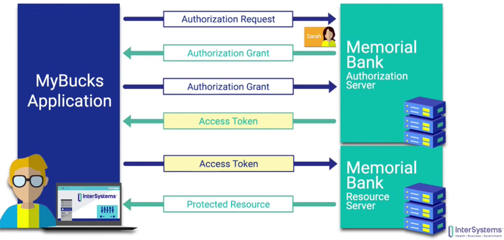

# 🐢 OAuth Basics

[ref 1](https://developer.okta.com/blog/2017/06/21/what-the-heck-is-oauth) ,   [ref 2](https://www.youtube.com/watch?v=CPbvxxslDTU)

---

## 1. What is OAuth?

- `API` 혹은 서비스가 아닌, 하나의 authorization(권한) 구현 방법이다.
- `OAuth 1.0a` 와 `OAuth 2.0` 은 엄밀히 다른 구현 방법이며(호환x), 후자가 대중적으로 활용되고있다.
- 인증서를 부여하는게 아닌, 액새스 토큰을 활용하여 권한을 부여한다.

 

## 2. How does it work?

- 상황 : MyBucks라는 어플이 통장정보들을 대쉬보드형태로 제공하기 위해 정보열람 권한부여받기까지의 과정

  

  1. 어플에서 은행의 `authorization server`에 권한 요청.
     여기서 사용자가 은행에게 어떤 권한을 허용할지 설정.
  2. 사용자의 허용 권한 범위 설정이 확인되면, 은행에서 어플로 권한부여코드를 전송.
  3. 어플은 권한부여권과 권한부여코드를 은행으로 전송.
     해당 과정에서 사용자의 개인정보는 오가지 않고, 열람될 수도 없다 (서버가 다름)
  4. 사용자가 허용한 권한만을 시행할 수 있는 액새스 토큰을 은행에서 생성하여 어플로 전달.

 

## 3. Why use OAuth?

- 사용자 권한부여에 대한 책임(구현)을 제3의 서비스에게 넘김으로써  => 구현속도 향상 & 안정성 확보(사용자의 개인정보는 일체 오가지 않습니다)
- 한번의 로그인으로 다양한 서버의 자원과 연결될 수 있다 => UX 향상

 

 

## How to safely store the Access Token..?

- CSRF, XSS 공격 위험..
- 쿠키 : csrf 에 취약
- 스토리지 : xss 에 취약